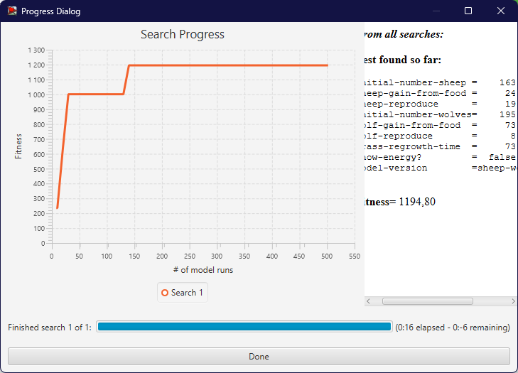
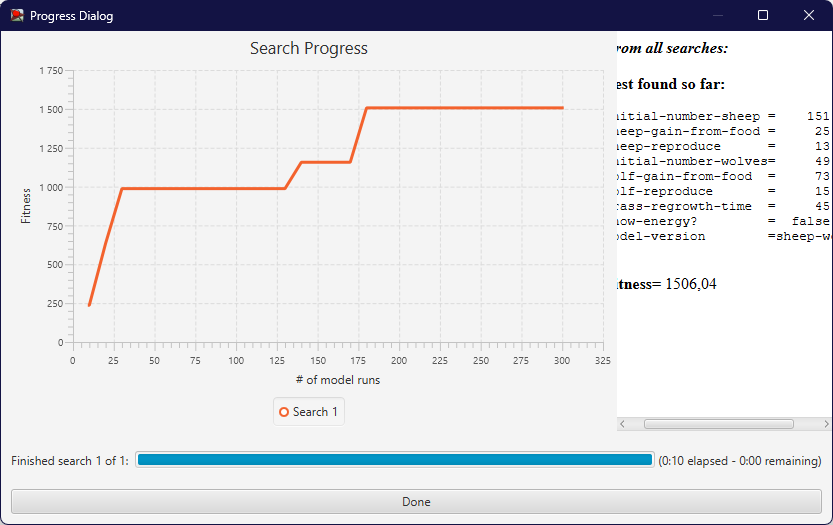

## Комп'ютерні системи імітаційного моделювання  
## СПм-23-4, **Оцевик Владислав Андрійович**  
### Лабораторна робота №**3**. Використання засобів обчислювального інтелекту для оптимізації імітаційних моделей  

 

### Варіант 7, модель у середовищі NetLogo:  
[Wolf Sheep Predation](https://www.netlogoweb.org/launch#http://www.netlogoweb.org/assets/modelslib/Sample%20Models/Biology/Wolf%20Sheep%20Predation.nlogo)  

 

## Вербальний опис моделі:  
Ця модель аналізує стабільність взаємодії між хижаками та їхньою здобиччю. Система вважається нестабільною, якщо вона приводить до вимирання хоча б одного з видів. Стабільна система, навпаки, здатна підтримувати баланс між популяціями на довготривалій основі, навіть попри періодичні коливання чисельності.  

### Два основних варіанти моделі:  
1. **Варіант «вівці-вовки»**:  
У цій версії вовки та вівці випадково переміщуються по ландшафту. Вовки шукають овець, щоб поповнити запас енергії, яка витрачається на кожен крок руху. Якщо вовки не знаходять їжу, вони гинуть. Розмноження відбувається з певною ймовірністю. Трава тут не враховується: вівці не втрачають і не отримують енергії під час їжі чи руху. Такий сценарій може бути нестабільним, оскільки популяції можуть вимирати через надмірне збільшення або зменшення чисельності.  

2. **Варіант «вівці-вовки-трава»**:  
У цьому випадку додається трава, яку вівці споживають для підтримки енергії. Якщо трава з’їдена, її відновлення займає певний час. Вовки поводяться так само, як і у першій моделі, але динаміка популяцій загалом стає більш стабільною. Ця модель наближається до класичних рівнянь Лотки-Вольтерра, адаптованих для дискретних агентів.  

### Керуючі параметри:  
- **model-version** — вибір версії моделі.  
- **initial-number-sheep** — початкова кількість овець.  
- **initial-number-wolves** — початкова кількість вовків.  
- **grass-regrowth-time** — час відновлення трави після з'їдання.  
- **sheep-gain-from-food** — енергія, яку вівці отримують від трави.  
- **wolf-gain-from-food** — енергія, яку вовки отримують, з’ївши вівцю.  
- **sheep-reproduce** — ймовірність розмноження вівці на кожному кроці.  
- **wolf-reproduce** — ймовірність розмноження вовка на кожному кроці.  

### Параметри візуалізації:  
- **show-energy** — показувати чи ні енергію агентів.  

### Показники роботи системи:  
- **sheep** — поточна кількість овець.  
- **wolves** — поточна кількість вовків.  
- **grass** — поточна кількість трави.  
- **populations** — графік змін чисельності овець, вовків та трави.  

 

### Налаштування середовища BehaviorSearch:  

**Обрана модель**:  
<pre>
C:\Program Files\NetLogo 6.3.0\models\Sample Models\Biology\Wolf Sheep Predation.nlogo
</pre>  

**Параметри моделі** (вкладка Model):  
*Автоматично вилучені діапазони параметрів із моделі*:
<pre>
["initial-number-sheep" [10 250]]
["sheep-gain-from-food" [1 50]]
["sheep-reproduce" [1 20]]
["initial-number-wolves" [10 250]]
["wolf-gain-from-food" [5 100]]
["wolf-reproduce" [1 20]]
["grass-regrowth-time" [5 100]]
["show-energy?" true false]
["model-version" "sheep-wolves" "sheep-wolves-grass"]
</pre>  

**Міра (Measure):**  
Для фітнес-функції було обрано **число овець**:  
<pre>
count sheep
</pre>  

**Налаштування цільової функції (Search Objective):**  
Метою є **максимізація** чисельності овець:
<pre>
Maximize Fitness
</pre>  

**Налаштування пошукового алгоритму (Search Algorithm):**  
Загальний вигляд:  

  

 

### Результати використання BehaviorSearch:  
**Результат пошуку за допомогою генетичного алгоритму (ГА):**  

  

**Результат пошуку за допомогою випадкового пошуку (ВП):**  

  

> **Примітка:**  
Для обох методів було проведено аналіз якості знайдених рішень та порівняно ефективність пошуку.
