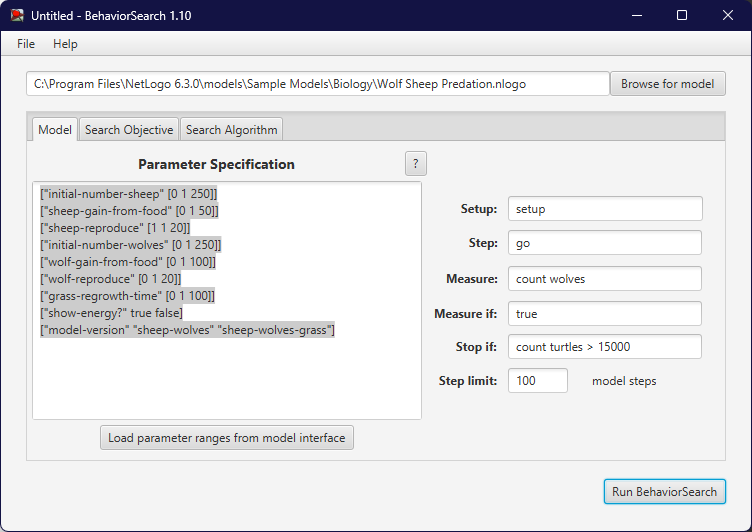
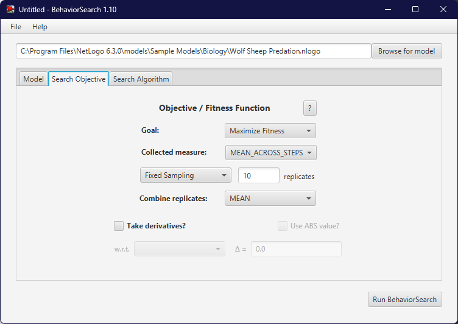
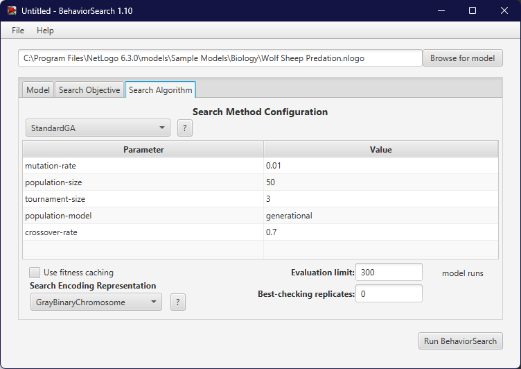
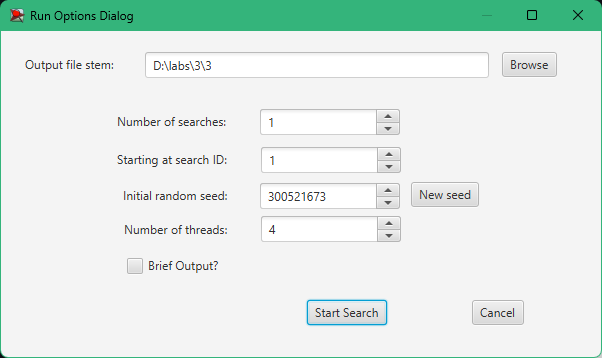

## Комп'ютерні системи імітаційного моделювання  
## СПм-23-4, **Оцевик Владислав Андрійович**  
### Лабораторна робота №**3**. Використання засобів обчислювального інтелекту для оптимізації імітаційних моделей

   

### Варіант 7, модель у середовищі NetLogo:  
[Wolf Sheep Predation](https://www.netlogoweb.org/launch#http://www.netlogoweb.org/assets/modelslib/Sample%20Models/Biology/Wolf%20Sheep%20Predation.nlogo)  

   

## Опис моделі:  
Модель досліджує стабільність взаємодії у системі «хижак-жертва». Система вважається нестабільною, якщо це може призвести до вимирання одного або кількох видів. Навпаки, стабільна система підтримує існування обох видів протягом тривалого часу, навіть за умов значних коливань чисельності.  

### Два варіанти реалізації моделі:  

1. **Версія «вівці-вовки»**:  
   Вівці та вовки хаотично пересуваються по полю. Вовки шукають овець для харчування, оскільки кожен їхній рух витрачає енергію. Без здобичі вовки гинуть. Усі тварини мають певну ймовірність розмноження. У цій версії трава вважається невичерпною, і вівці не втрачають енергію під час руху чи їжі. Такий варіант моделі демонструє динаміку, яка є нестабільною, проте дозволяє вивчати взаємодії видів у сприятливому середовищі.  

2. **Версія «вівці-вовки-трава»**:  
   Тут до моделі додається трава, яку вівці повинні їсти для збереження енергії. Вовки поводяться аналогічно першій версії. З'їдена трава відростає через певний час. Цей варіант є складнішим, але стабільнішим. Він краще відображає коливання чисельності населення за моделями Лотки-Вольтерра.  

### Налаштування моделі:  
- **model-version** — вибір версії моделі.  
- **initial-number-sheep** — початкова кількість овець.  
- **initial-number-wolves** — початкова кількість вовків.  
- **grass-regrowth-time** — час відростання трави.  
- **sheep-gain-from-food** — енергія, яку отримує вівця від трави.  
- **wolf-gain-from-food** — енергія, яку отримує вовк від вівці.  
- **sheep-reproduce** — ймовірність розмноження овець.  
- **wolf-reproduce** — ймовірність розмноження вовків.  

### Візуалізація:  
- **show-energy** — показ енергії кожної тварини.  

### Моніторинг показників:  
- **sheep** — поточна кількість овець.  
- **wolves** — поточна кількість вовків.  
- **grass** — кількість трави.  
- **populations** — графік із показниками чисельності.  

   

## Налаштування BehaviorSearch:  

### Вибір моделі:  
<pre>
C:\Program Files\NetLogo 6.3.0\models\Sample Models\Biology\Wolf Sheep Predation.nlogo
</pre>  

**Автоматичне завантаження параметрів моделі**:  
<pre>
["initial-number-sheep" [0 1 250]]
["sheep-gain-from-food" [0 1 50]]
["sheep-reproduce" [1 1 20]]
["initial-number-wolves" [0 1 250]]
["wolf-gain-from-food" [0 1 100]]
["wolf-reproduce" [0 1 20]]
["grass-regrowth-time" [0 1 100]]
["show-energy?" true false]
["model-version" "sheep-wolves" "sheep-wolves-grass"]
</pre>  

  

### Цільова функція:  
Максимізація кількості вовків (**Goal**: **Maximize Fitness**).  

  

### Алгоритм пошуку:  
Для пошуку оптимальних параметрів використовувались:  
1. **Генетичний алгоритм**  
2. **Випадковий пошук**  

  

   

## Результати:  
- **Генетичний алгоритм**:  
    

- **Випадковий пошук**:  
    

- **Діалогове вікно**:  
    
